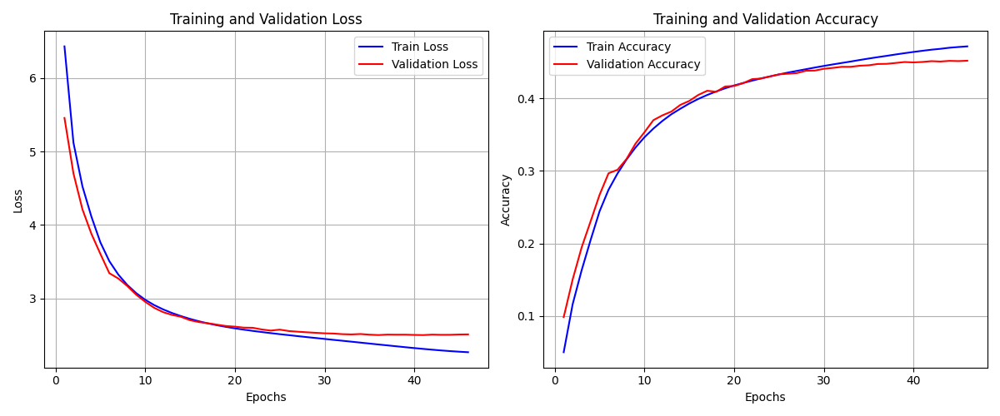
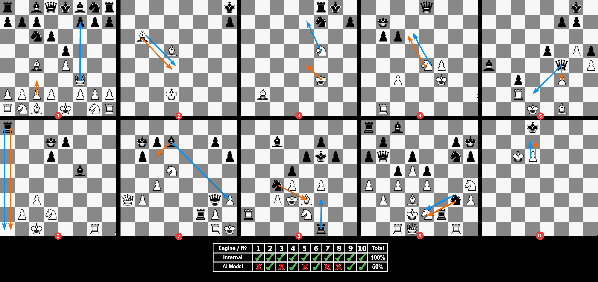
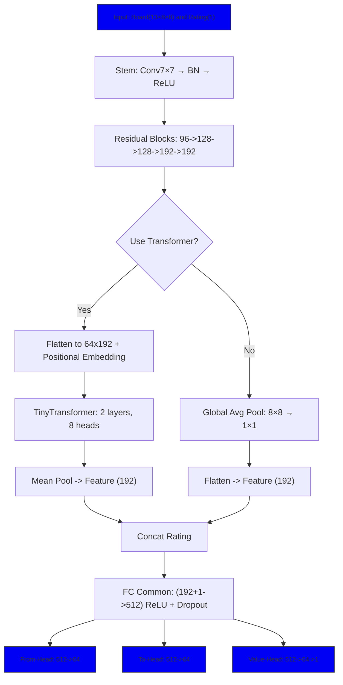
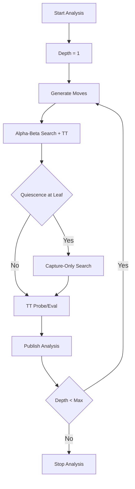

<h1 align="center">EvilChess Project</h1>

## Functionallity (for now):
* Rules of the game
* History moves
* Color CLI
* R/W FEN (Forsyth–Edwards Notation)
* R/W PGN (Portable Game Notation)
* R/W SAN (Standard Algebraic Notation)
* Internal Engine (Iterative Deep Search)
* Engine support via UCI protocol
* Color GUI (Ebiten Library):
* * Play Scene
* * Editor Scene
* * Analyzer Scene
* * Settings Scene
* WASM Test-Build (it works LOL)
* My AI Engine (not integrated)

## Functionallity (in the future)
* Chess Model Intagration

---

<h2 align="center">GUI Preview</h2>

  

---

<h1 align="center">Comparison: AI ​​Model vs Internal Engine</h1>

### Summary
I implemented a small [internal chess](#internal-engine-overview) engine that performs exhaustive depth-first move search and relies largely on a material-based evaluation. I trained [AI model](#chess-ai-model-overview) (as far as my resources allowed) to predict moves from FEN -> Move snapshots extracted from a filtered subset of [Lichess games](https://database.lichess.org/) - sep 2025 dataset. Training ran for **46 epochs** and lasted about **10 hours** until EarlyStopping triggered (overfitting trigger).

  

Unfortunately the model was not integrated into the app, but you can download and test it locally from the [repository directory](/ai/learn/).

### Comparative tests
I ran several head-to-head and task-based comparisons between the internal engine and the neural model:

1. **Tactical puzzles (small composed tasks)**: Amateur players will quickly master these tasks - this is also reproduced by the internal engine, whereas the AI ​​model was unable to do this reliably.

  

2. [**Five personal matches(PGN)**](materials/versus/chess_ai_tour.pgn): AI model 4 - Internal engine 1 (clear superiority of the AI in these encounters).

### Observations / Qualitative behavior
- The AI model learned several positional principles: piece development toward the center, space-gaining plans, and even material sacrifices to increase activity.  
- The model showed a strong tendency to execute horizontal/linear back-rank mates when possible.  
- The network is relatively small, and its combinational/calculation depth is limited - it struggles with long tactical variations. This weakness led to at least one game where the internal engine delivered an early mate via a simple combination.

Overall: the AI emphasizes positional play; the internal engine remains superior on short tactical puzzles and precise combination calculation.

---

<h2 align="center">Chess AI Model Overview</h2>

---

<h2 align="center">Internal Engine Overview</h2>

---

## References

- [PGN Wiki](https://en.wikipedia.org/wiki/Portable_Game_Notation)
- [FEN Wiki](https://en.wikipedia.org/wiki/Forsyth%E2%80%93Edwards_Notation)
- [Ebiten Docs](https://ebitengine.org/en/documents/)
- [Piece Images](https://commons.wikimedia.org/wiki/Category:PNG_chess_pieces/Standard_transparent)
- [Crown Image](https://www.pngwing.com/en/free-png-ntlel)
- [Font NotoSansDisplay](https://fonts.google.com/noto/specimen/Noto+Sans+Display)
- [Font PressStart2P](https://fonts.google.com/specimen/Press+Start+2P)
- [Stockfish Engine](https://stockfishchess.org/download/)
- [Lichess Open Database](https://database.lichess.org/)
