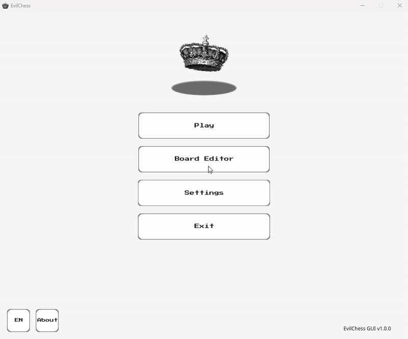
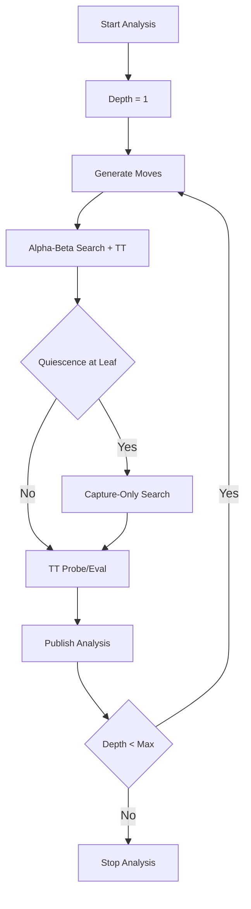

<h1 align="center">EvilChess Project</h1>

## Functionallity (for now):
* Rules of the game
* History moves
* Color CLI
* R/W FEN (Forsyth–Edwards Notation)
* R/W PGN (Portable Game Notation)
* R/W SAN (Standard Algebraic Notation)
* Internal Engine (Iterative Deep Search)
* Engine support via UCI protocol
* Color GUI (Ebiten Library):
* * Play Scene
* * Editor Scene
* * Analyzer Scene
* * Settings Scene
* WASM Test-Build (it works LOL)

## Functionallity (in the future)
* My AI Engine (experimental)

---

<h2 align="center">GUI Preview</h2>

  

---

<h2 align="center">Internal Engine Overview</h2>

---

## References

- [PGN Wiki](https://en.wikipedia.org/wiki/Portable_Game_Notation)
- [FEN Wiki](https://en.wikipedia.org/wiki/Forsyth%E2%80%93Edwards_Notation)
- [Ebiten Docs](https://ebitengine.org/en/documents/)
- [Piece Images](https://commons.wikimedia.org/wiki/Category:PNG_chess_pieces/Standard_transparent)
- [Crown Image](https://www.pngwing.com/en/free-png-ntlel)
- [Font NotoSansDisplay](https://fonts.google.com/noto/specimen/Noto+Sans+Display)
- [Font PressStart2P](https://fonts.google.com/specimen/Press+Start+2P)
- [Stockfish Engine](https://stockfishchess.org/download/)
